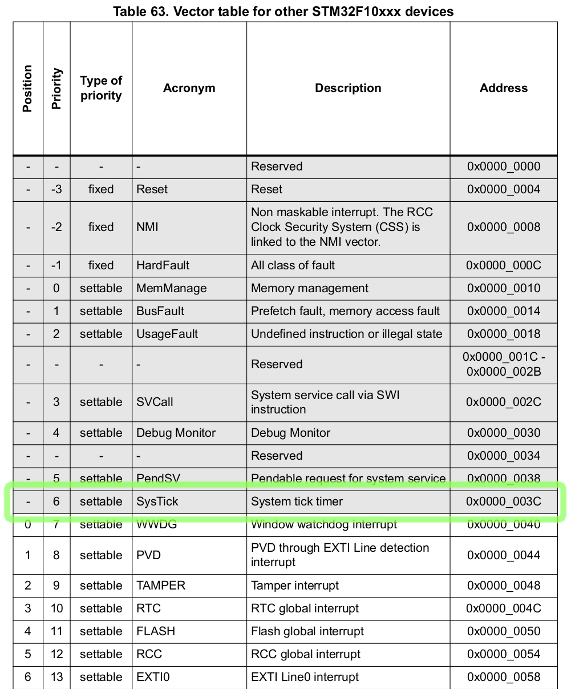

# Work with a Timer

In this chapter we will work with a timer peripheral to timely assert and
de-assert the PC13 pin, which is connected to the green LED on the Blue Pill
board. The STM32F103 MCU possesses 7 timers of 4 different kinds. We will use
the SysTick timer, which is present in all Cortex-M MCUs.

Drone already has a universal interface for timer peripherals in a form of
`drone_cortexm::drv::timer::Timer` trait, as well as the SysTick driver
implementation at `drone_cortexm::drv::sys_tick::SysTick`. However in this
walk-through we will use interrupts and memory-mapped registers directly.

Firstly, we need to allocate an interrupt used by the timer peripheral. Let's
refer to the Reference Manual:



Unlike the RCC interrupt from the previous chapter, the SysTick doesn't have a
position value. This means that we need to declare it using a precise name and
before all the positional interrupts:

```rust
thr::nvic! {
    // ... The header is skipped ...

    threads => {
        exceptions => {
            /// All classes of faults.
            pub hard_fault;
            /// System tick timer.
            pub sys_tick;
        };
        interrupts => {
            /// RCC global interrupt.
            5: pub rcc;
        };
    };
}
```

According to the Reference Manual, the frequency of the SysTick clock is the
system clock divided by 8. Let's add this to our constants module
`src/consts.rs`:

```rust
/// SysTick clock frequency.
pub const SYS_TICK_FREQ: u32 = SYS_CLK / 8;
```

Let's update our root handler:

```rust
//! The root task.

use crate::{
    consts::{PLL_MULT, SYS_CLK, SYS_TICK_FREQ},
    thr,
    thr::ThrsInit,
    Regs,
};
use drone_core::log;
use drone_cortexm::{fib, reg::prelude::*, swo, thr::prelude::*};
use drone_stm32_map::{
    periph::{
        gpio::{periph_gpio_c, GpioC, GpioPortPeriph},
        sys_tick::{periph_sys_tick, SysTickPeriph},
    },
    reg,
};
use futures::prelude::*;

/// An error returned when a receiver has missed too many ticks.
#[derive(Debug)]
pub struct TickOverflow;

/// The root task handler.
#[inline(never)]
pub fn handler(reg: Regs, thr_init: ThrsInit) {
    let thr = thr::init(thr_init);
    let gpio_c = periph_gpio_c!(reg);
    let sys_tick = periph_sys_tick!(reg);

    thr.hard_fault.add_once(|| panic!("Hard Fault"));

    raise_system_frequency(
        reg.flash_acr,
        reg.rcc_cfgr,
        reg.rcc_cir,
        reg.rcc_cr,
        thr.rcc,
    )
    .root_wait();

    beacon(gpio_c, sys_tick, thr.sys_tick)
        .root_wait()
        .expect("beacon fail");

    // Enter a sleep state on ISR exit.
    reg.scb_scr.sleeponexit.set_bit();
}

// We leave this function unchanged.
async fn raise_system_frequency(...) {...}

async fn beacon(
    gpio_c: GpioPortPeriph<GpioC>,
    sys_tick: SysTickPeriph,
    thr_sys_tick: thr::SysTick,
) -> Result<(), TickOverflow> {
    Ok(())
}
```

We added an error type `TickOverflow`, which we discuss later:

```rust
#[derive(Debug)]
pub struct TickOverflow;
```

At the beginning of the root handler we added calls to two `periph_*!`
macros. These macros take parts of `reg` structure and move them into separate
`gpio_c` and `sys_tick` structures. The macros do nothing at the run-time,
because `reg`, `gpio_c`, and `sys_tick` are zero sized types, but they inform
the type system of moved ownership.

```rust
    let gpio_c = periph_gpio_c!(reg);
    let sys_tick = periph_sys_tick!(reg);
```

Those structures hold all registers associated with the corresponding
peripherals. We pass those peripheral structures to a new `async` function named
`beacon`. This time the function returns a `Result` type, and we handle it with
a panic:

```rust
    beacon(gpio_c, sys_tick, thr.sys_tick)
        .root_wait()
        .expect("beacon fail");
```

Let's start filling out the `beacon` function. We configure the SysTick timer
peripheral to trigger the SysTick interrupt each second:

```rust
    // Attach a listener that will notify us on each interrupt trigger.
    let mut tick_stream = thr_sys_tick.add_pulse_try_stream(
        // This closure will be called when a receiver no longer can store the
        // number of ticks since the last stream poll. If this happens, a
        // `TickOverflow` error will be sent over the stream as is final value.
        || Err(TickOverflow),
        // A fiber that will be called on each interrupt trigger. It sends a
        // single tick over the stream.
        fib::new_fn(|| fib::Yielded(Some(1))),
    );
    // Clear the current value of the timer.
    sys_tick.stk_val.store(|r| r.write_current(0));
    // Set the value to load into the `stk_val` register when the counter
    // reaches 0. We set it to the count of SysTick clocks per second, so the
    // reload will be triggered at each second.
    sys_tick.stk_load.store(|r| r.write_reload(SYS_TICK_FREQ));
    sys_tick.stk_ctrl.store(|r| {
        r.set_tickint() // Counting down to 0 triggers the SysTick interrupt
            .set_enable() // Start the counter
    });
```

Now the `tick_stream` variable holds an instance of a `Stream` type. We `await`
for each item of the stream until it ends. The `tick` variable is a number of
pulses (in our case seconds) passed since the last stream poll. If the thread is
not heavily interrupted, normally we expect it to be just `1`.

```rust
    while let Some(tick) = tick_stream.next().await {
        for _ in 0..tick?.get() {
            println!("sec");
        }
    }
```

Let's flash this program and view the SWO output:

```shell
$ just flash
$ just log
```

You should see the following output. A "sec" line will be printed infinitely
each second.

```text
================================== LOG OUTPUT ==================================
sec
sec
sec
sec
sec
```

Now it's time to use the GPIO peripheral, to drive the green LED on our Blue
Pill.


According to the Blue Pill schematic above, the current is flowing through D2
when PC13 line is low (shorted to GND), and not flowing when its high (shorted
to VCC). Let's configure the PC13 pin, place this at the beginning of the
`beacon` function:

```rust
    gpio_c.rcc_busenr_gpioen.set_bit(); // GPIO port C clock enable
    gpio_c.gpio_crh.modify(|r| {
        r.write_mode13(0b10) // Output mode, max speed 2 MHz
            .write_cnf13(0b00) // General purpose output push-pull
    });
```

Let's speed up our timer to wake up each 125 milliseconds. Update the `stk_load`
initialization code as follows:

```rust
    // Set the value to load into the `stk_val` register when the counter
    // reaches 0. We set it to the count of SysTick clocks per second divided by
    // 8, so the reload will be triggered each 125 ms.
    sys_tick
        .stk_load
        .store(|r| r.write_reload(SYS_TICK_FREQ / 8));
```

Update the stream loop:

```rust
    // A value cycling from 0 to 7. Full cycle represents a full second.
    let mut counter = 0;
    while let Some(tick) = tick_stream.next().await {
        for _ in 0..tick?.get() {
            // Each full second print a message.
            if counter == 0 {
                println!("sec");
            }
            match counter {
                // On 0's and 250's millisecond pull the pin low.
                0 | 2 => {
                    gpio_c.gpio_bsrr.br13.set_bit();
                }
                // On 125's, 375's, 500's, 625's, 750's, and 875's millisecond
                // pull the pin high.
                _ => {
                    gpio_c.gpio_bsrr.bs13.set_bit();
                }
            }
            counter = (counter + 1) % 8;
        }
    }
```

Now flash the application to your Blue Pill board with:

```shell
$ just flash
```

And you should see the following result:

<video autoplay loop muted width="100%">
<source src="../assets/blink.webm" type="video/webm" />
<source src="../assets/blink.mp4" type="video/mp4" />
</video>

The full code for this application can be found at
[Github](https://github.com/drone-os/bluepill-blink).
