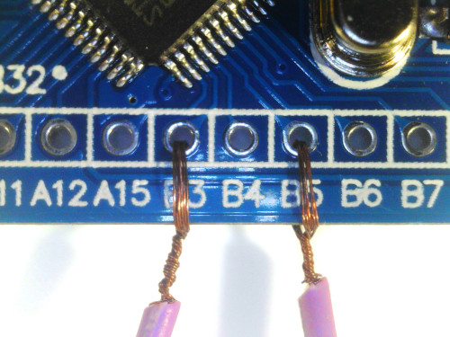

# Hardware

To make a start with Drone the most affordable, the following reference hardware
was selected for this book:

- 2× STM32F103C8T6 development boards (Blue Pills)
- CH340G USB-TTL converter
- Female-to-female jumper wires

And optionally:

- 2× Angled 40-pins 2.54 mm header - Blue Pills already come with straight pin headers

Usually Blue Pills come with not soldered pin-headers, except the SWD header. If
you don't want to solder, you can twist the wires like this:

Here are the Blue Pills soldered with the angled pin-headers:

In the next section we will show how to convert one of the Blue Pills to a Black
Magic Proble.
