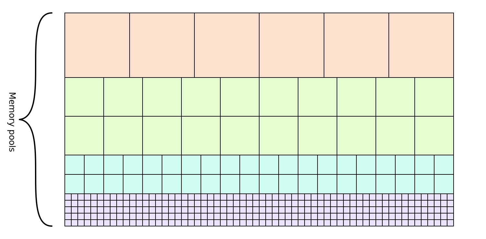

# Dynamic Memory

In order to unleash the full potential of Rust type system, Drone OS provides a
global allocator. This might seem paradoxical, but addition of some run-time
dynamism helps with compile-time checks. Consider the signature of
`thread::spawn` function from libstd:

```rust
pub fn spawn<F, T>(f: F) -> JoinHandle<T> where
    F: FnOnce() -> T,
    F: Send + 'static,
    T: Send + 'static;
```

This means that in `std` applications to spawn a new OS thread, one need to call
the `thread::spawn` function in the run-time, passing it a closure of type
`F`. An interesting aspect here is the `F: Send + 'static` bound. This
guarantees that the data captured by the closure is also `Send` and
`'static`. `'static` rejects references that has a narrower scope than the
entire program. And `Send` rejects thread-unsafe types. A nice thing here is
that all of these properties are checked in the compile-time. Naturally,
equivalent functions in Drone OS have similar signatures.

An allocator for embedded systems should meet the following conditions:

1. Determinism. For real-time systems, it is important that allocation,
   deallocation, and reallocation operations have predictable timing.

2. Small code size. For example jemalloc can add hundreds of kilobytes to the
   binary size, while some supported MCUs have 64 KB of flash memory or even
   less.

Drone OS ships with a simple and predictable allocator, which fulfills the above
conditions. It splits the whole heap memory region into a number of fixed-sized
memory pools:



The pools are configured at the compile-time in the `Drone.toml`. For example:

```toml
[heap]
size = "10K"
pools = [
    { block = "4", capacity = 118 },
    { block = "8", capacity = 148 },
    { block = "20", capacity = 82 },
    { block = "56", capacity = 34 },
    { block = "116", capacity = 16 },
    { block = "208", capacity = 8 },
    { block = "336", capacity = 3 },
    { block = "512", capacity = 1 },
]
```

In result, the Drone allocator achieves all its operations to be constant-time
and entirely atomic. However, a disadvantage of this approach is that in order
to use the memory efficiently, the pools need to be tuned for each particular
application. Drone provides tools to make it as easy as possible, which we will
cover in the next chapter.

By providing a global allocator, a Drone application can use not only the Rust's
`core` crate, but also the `alloc` crate. It enables one to use the following
Rust types: `String`, `Vec`, `Box`, `Rc`, `Arc`, and more.
